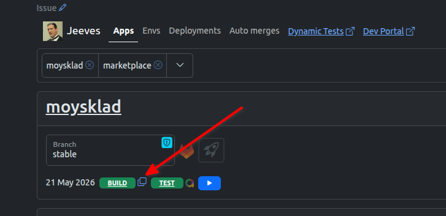

# Рукописный java sdk

## Запуск тестов против спейса

### Вариант 1
Запустить пайплайн в этом проекте на версии 0.4.0, указав переменные:
* BRANCH - ветка с изменениями в репозитории https://github.com/moysklad/java-remap-1.2-sdk
* USE_OLD_SDK  (true)
* PARAM_VERSION - актуальная версия сборки для развертывания окружения (можно взять с jeeves)

[Ссылка на предзаполненный пайплайн](https://git.company.lognex/moysklad/misc/remap-api-specification/-/pipelines/new?ref=0.4.0&var%5BBRANCH%5D=MC-&var%5BUSE_OLD_SDK%5D=true&var%5BPARAM_VERSION%5D=stable-)

### Вариант 2
Запустить пайплайн в этом проекте на версии 0.4.0, указав переменные:
* BRANCH - ветка с изменениями в репозитории https://github.com/moysklad/java-remap-1.2-sdk
* USE_OLD_SDK (true)
* API_HOST - указать хост на котором развернуто окружение для прохождения тестов SDK.
* API_LOGIN - логин от аккаунта на окружении. Аккаунт на корпоративном тарифе с 15 точками продаж и опцией производства
* API_PASSWORD - пароль от аккаунта

[Ссылка на предзаполненный пайплайн](https://git.company.lognex/moysklad/misc/remap-api-specification/-/pipelines/new?ref=0.4.0&var%5BBRANCH%5D=MC-&var%5BUSE_OLD_SDK%5D=true&var%5BAPI_HOST%5D=https://api-api-2.testms-test.lognex.ru&var%5BAPI_LOGIN%5D=admin@qwe3&var%5BAPI_PASSWORD%5D=123123)

---

## Релиз старой версии Java SDK

1. Залить изменения в ветку `master` в репозитории https://github.com/moysklad/java-remap-1.2-sdk
2. Запустить релизный пайплайн в этом проекте на версии 0.4.0. [Ссылка на предзаполненный пайплайн](https://git.company.lognex/moysklad/misc/remap-api-specification/-/pipelines/new?ref=0.4.0&var%5BBRANCH%5D=release&var%5BUSE_OLD_SDK%5D=true&var%5BAPI_HOST%5D=https://api-api-2.testms-test.lognex.ru&var%5BAPI_LOGIN%5D=admin@qwe3&var%5BAPI_PASSWORD%5D=123123)
3. При успешном завершении пайплайна через какое-то время артифакт появится в личном кабинете компанейского maven репозитория. Тегнуть команду АПИ на публикацию артифакта

Для запуска пайплайна необходимо указать обязательные параметры пайплайна:
* BRANCH (release)
* USE_OLD_SDK (true)
* API_HOST - указать хост на котором развернуто окружение для прохождения тестов SDK.
* API_LOGIN - логин от аккаунта на окружении. Аккаунт на корпоративном тарифе с 15 точками продаж и опцией производства
* API_PASSWORD - пароль от аккаунта